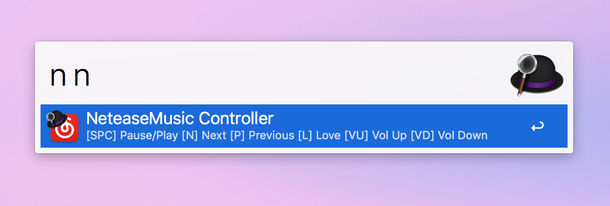
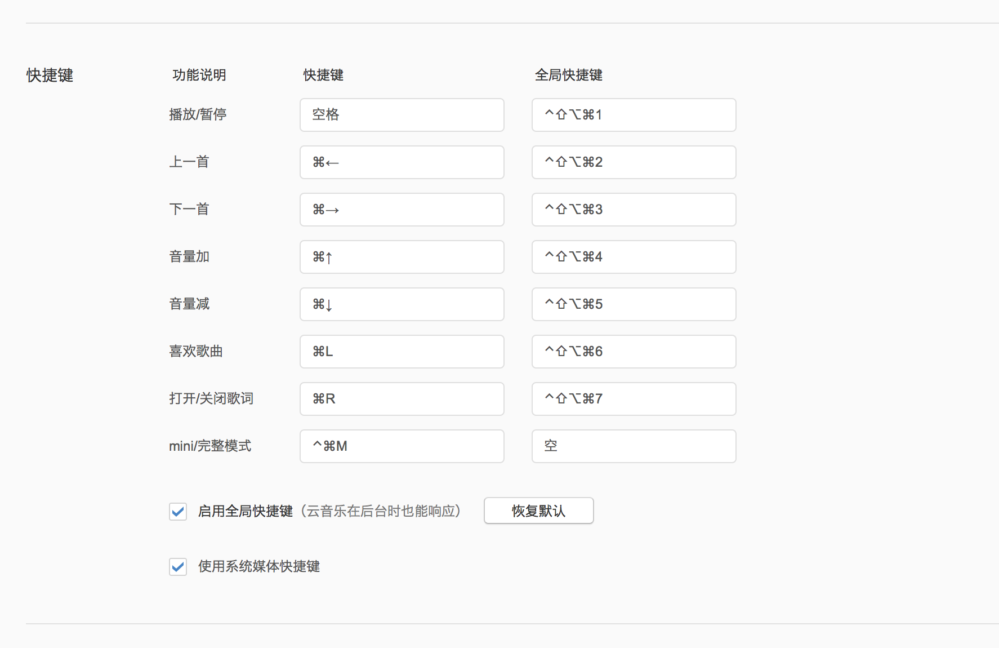

# NeteaseMusic Alfred Controller

## 下载和使用

点击[**这里**](https://github.com/Ironaki/AW_NeteaseAlfredController/blob/master/NeteaseMusicController.alfredworkflow?raw=true)下载，下载后双击既可自动导入（你需要拥有 Alfred Powerpack，免费版不支持 Workflow）。

此扩展需要开启网易云音乐全局快捷键，使其在后台时也可以响应

**为避免按键冲突请将全局快捷键设置为下图所示**

## 支持功能

|关键字|功能|
|------|--------|
|`n ` or `n pause`|暂停/播放|
|`n n` or `n next`|下一首|
|`n p` or `n previous`|上一首|
|`n l` or `n love`|为当前歌曲加心|
|`n vu` or `n volumup`|增加音量|
|`n vd` or `n volumdown`|减小音量|
|`n r` or `n lyrics` |显示/关闭歌词|

## 其他

此版本兼容 Alfred 2 和 Alfred 3

此版本在原版基础上改了按键设置和提示文本。原版在[这个repo](https://github.com/li-xinyang/AW_NeteaseAlfredController)。

**配置**

可以参考[这个文件](./controller.applescript)，直接在Alfred里设置。

[Mac OS X 下功能按键在 AppleScript 下的编号 (Key Codes for Function and Special Keys in Applescript)](http://macbiblioblog.blogspot.sg/2014/12/key-codes-for-function-and-special-keys.html)
